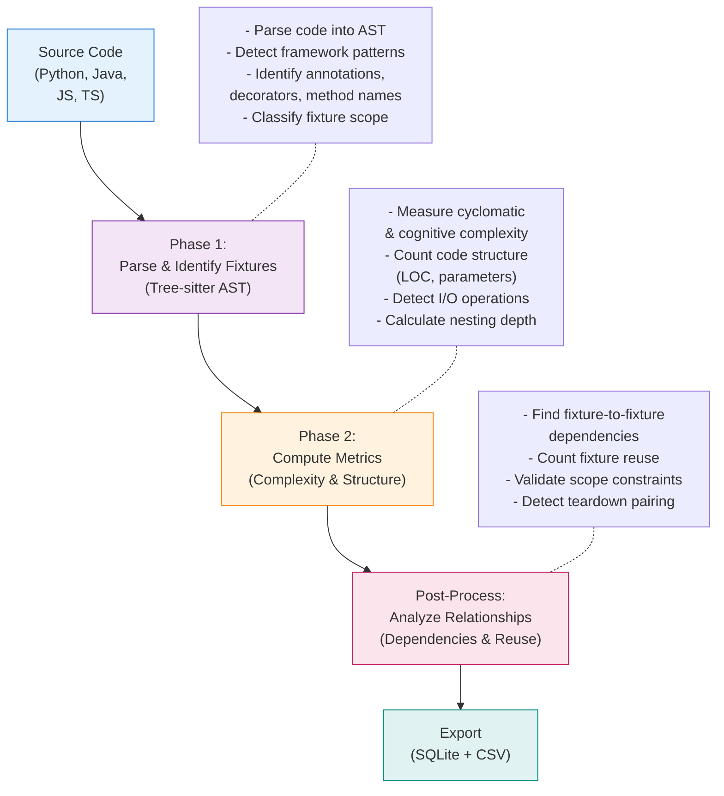

# Fixture Detection Logic

## Executive Summary

FixtureDB detects test fixture definitions across Python, Java, JavaScript, and TypeScript using a **two-phase pipeline**:

1. **Phase 1: AST-Based Detection** — Tree-sitter parses source code into Abstract Syntax Trees (ASTs) to identify fixture-defining constructs (decorators, annotations, method names) with language-specific patterns
2. **Phase 2: Metrics & Relationships** — Computes quantitative metrics (complexity, scope, dependencies) and post-processes to detect fixture relationships and reuse patterns

**Detection Pipeline Overview:**

*For Mermaid diagram source code, see [Appendix: Mermaid Diagram Source](#appendix-mermaid-diagram-source) at the end of this document.*

---

## Important: Fixture Detection vs Agent Detection

**This document describes FIXTURE DETECTION** — the process of identifying test fixture definitions (setup methods, fixtures, mocks) in source code.

This is DIFFERENT from **AGENT DETECTION** — the process of identifying which commits were authored/co-authored by AI assistants. For agent detection, see [Agent Detection Methodology](./agent-detection.md).

**Key Distinction:**
- **Fixture Detection:** Answers "What is a test fixture?" (AST parsing for setup/teardown)
- **Agent Detection:** Answers "Who wrote this code?" (Git history parsing for Co-authored-by trailers)

Both are essential for the FixtureDB between-group study:
1. Agent Detection identifies AI-generated commits (via trailers)
2. Fixture Detection extracts and analyzes the fixtures themselves

## How Fixtures Are Detected

### Language-Specific Patterns

Fixtures are defined differently across frameworks and languages. We use **framework-specific detection patterns** to identify them accurately:

| Language | Detection Method | Examples |
|----------|-----------------|----------|
| **Python** | Decorators & method names | `@pytest.fixture`, `setUp()`, `@given()` (Behave BDD) |
| **Java** | Annotations & method patterns | `@Before`, `@BeforeEach`, `@BeforeMethod`, `@Bean` (Spring) |
| **JavaScript/TypeScript** | Hook function calls | `beforeEach()`, `beforeAll()`, `before()` (Jest/Mocha) |

**Key Design Decision**: Framework-specific detection is necessary because no general-purpose tool can distinguish between fixture setup, helper functions, and regular methods without understanding framework semantics.

See **[fixture-patterns-reference.md](../usage/fixture-patterns-reference.md)** for complete catalog of 50+ fixture types, detection examples, and patterns across all supported frameworks.

The pattern tables themselves are not hardcoded in the per-language detector
files — they're loaded from
**[collection/config_data/fixture_definitions.yaml](../../collection/config_data/fixture_definitions.yaml)**,
which is the executable, single source of truth for what counts as a
fixture per language, and also documents (in an `excluded` list per
language) known boundary cases the detector deliberately does not catch —
see [configuration.md](configuration.md#reference-data-catalogs) and the
"Known Exclusions & Boundary Cases" section of
[fixture-patterns-reference.md](../usage/fixture-patterns-reference.md#known-exclusions--boundary-cases).

### Async Fixtures

Async fixture definitions are captured by our detector the same as sync
ones — the lifecycle hook name, decorator, or annotation is the detection
signal, not the function's async qualifier:

- **Python**: `async def` functions decorated with `@pytest.fixture` are
  matched identically to sync ones. `@pytest_asyncio.fixture` (the
  dedicated pytest-asyncio decorator, standard for FastAPI/async test
  setup) is matched by the same rule as `@pytest.fixture` — the decorator
  text only needs to contain `"pytest"` and `"fixture"` as substrings, and
  `pytest_asyncio.fixture` contains both. It is not tracked as a separate
  `fixture_type`.
- **JavaScript/TypeScript**: `beforeEach(async () => {...})` is still a
  `call_expression` whose function name is `beforeEach` — `async` only
  qualifies the callback argument, not the call itself. The same holds for
  TypeScript decorator-style hooks (`@BeforeEach async setup() {...}`): the
  decorator precedes the method regardless of the method's `async` keyword.

This is verified explicitly, not just assumed — see `TestAsyncPythonFixtures`,
`TestAsyncJavaScriptFixtures`, `TestTypeScriptAsyncAwait`, and
`TestTypeScriptDecoratorHooks` in `tests/collection/test_extractor_unit/`.

### Scope Classification

All detected fixtures are classified by execution scope:

- **per_test**: Runs before/after each individual test (most common)
- **per_class**: Runs once per test class or suite
- **per_module**: Runs once per test file (Python-specific)
- **global**: Runs once for entire test suite

Scope is consistently mapped across frameworks (e.g., `@Before` = per_test, `@BeforeClass` = per_class in Java; `beforeEach` = per_test, `beforeAll` = per_class in JavaScript).

---

## Fixture Metrics

For each detected fixture, the system computes **14 quantitative metrics** across three categories:

### Code Complexity (2 metrics)

| Metric | Definition | Tool(s) | Notes |
|--------|-----------|---------|-------|
| `cyclomatic_complexity` | McCabe complexity (decision points) | Lizard | Standard metric; Python, Java, JavaScript, TypeScript |
| `max_nesting_depth` | Maximum control structure nesting | Tree-sitter AST | Structural measure independent of complexity |

**Note on Cognitive Complexity:** Originally, we attempted to compute cognitive complexity (a nesting-weighted understandability metric) using the SonarQube algorithm in Python and a formula fallback for other languages. However, since `complexipy` (the only programmatic implementation) only supports Python and no equivalent alternatives exist for Java, JavaScript, or TypeScript, we removed this metric entirely to avoid inconsistent/unreliable cross-language metrics.

### Code Structure (4 metrics)

| Metric | Definition | Approach | Notes |
|--------|-----------|----------|-------|
| `loc` | Lines of code (non-blank, non-comment) | Lizard | Consistent with industry standard |
| `num_parameters` | Count of parameters in fixture signature | Lizard | Direct extraction |
| `num_objects_instantiated` | Count of object/instance creations | Custom regex | Filters for `new ClassName(...)` patterns |
| `num_external_calls` | Database, HTTP, file I/O operations | Custom regex | Domain-specific; detected via patterns like `open()`, `requests.get()`, `db.query()` |

### Fixture Properties (3 metrics)

| Metric | Definition | Approach |
|--------|-----------|----------|
| `framework` | Testing framework detected | Framework registry + regex |
| `reuse_count` | Number of tests using this fixture | AST analysis |
| `has_teardown_pair` | Cleanup logic paired with setup | AST pattern matching |

### Fixture Relationships (4 metrics, Python/pytest only)

| Metric | Definition | Implementation |
|--------|-----------|-----------------|
| `fixture_dependencies` | Other fixtures this fixture depends on | Parameter injection pattern matching |
| `fixture_scope` | Execution scope (per_test, per_class, etc.) | Annotation/decorator parsing + scope propagation |
| `num_objects_mocked` | Number of mock usages detected | Regex patterns for mock frameworks |
| `raw_source` | Source code snippet | Text extraction |

For detailed metric definitions, calculations, and academic references, see **[metrics-reference.md](metrics-reference.md)**.

---

## Mock Framework Detection

Mock usage is detected in a **second pass** after fixture extraction using regex patterns across:

- **Python**: `unittest.mock` (`patch(...)`, `patch.object(...)`, `Mock`/`MagicMock`/`AsyncMock`, `create_autospec`, both `mock.patch(...)` and the bare `patch(...)` import form), `pytest-mock` (`mocker.patch(...)`, `mocker.patch.object(...)`), pytest's built-in `monkeypatch` fixture
- **Java**: Mockito, EasyMock, MockK
- **JavaScript/TypeScript**: Jest (`jest.fn/spyOn/mock/mocked/createMockFromModule`), Sinon (`stub/spy/mock/fake/replace/createStubInstance`), Vitest

For each mock detected, we record:
- **framework**: Mock framework name (e.g., `mockito`, `unittest_mock`, `sinon`)
- **category**: Classic test-double taxonomy (Meszaros; see also Fowler's "Mocks Aren't Stubs") — `dummy`/`stub`/`spy`/`mock`/`fake`
- **target_identifier**: What is being mocked (if extractable)
- **num_interactions_configured**: Count of assertions/verifications
- **raw_snippet**: Code snippet for manual inspection

**Test-double category classification**: each `mock_patterns` entry is
classified by searching the *construct's own name* (not the captured
target) for a category keyword, case-insensitively, in priority order
`dummy > stub > spy > fake > mock` — "mock" is treated as the least
specific category since both the literature and developers use it
informally as the name for the whole family. Most constructs resolve this
way directly (`sinon.spy` → spy, `sinon.stub` → stub). A handful contain no
category keyword at all (`create_autospec`, bare `patch()`/`patch.object()`,
`monkeypatch.*`, `jest.fn()`/`vi.fn()`, `sinon.replace()`,
`gomock.NewController`, testify's `.On()`) and are classified instead by a
documented manual override (`category_override_reason` in the YAML),
reasoned from that construct's actual documented behavior — e.g.
`monkeypatch` is `stub`, not `mock`, because it substitutes predetermined
behavior with no built-in call-verification API. **`dummy` is never
assigned**: distinguishing a dummy from a mock depends on how the double is
*used* afterward (configured/verified, or not), which needs data-flow
analysis of the fixture body — not a simple keyword match — so per this
project's preference for high-precision, simple heuristics over
completeness, it's left undetected rather than guessed.

**Test coverage**: `tests/collection/test_mock_detection/test_mock_pattern_catalog_coverage.py`
is parametrized directly over every entry in `mock_patterns` (not a
hand-picked subset) and asserts two things for each: the pattern matches
its own minimal sample, and — critically — no *other* pattern in the
catalog also matches that sample. That second check is what caught two
real pattern-collision bugs during this test file's own construction: the
bare `Mock()`/`MagicMock()`/`AsyncMock()` pattern matched as a substring
inside Java's `EasyMock.createMock(...)`, and MockK's `mock(X.class)`
pattern matched inside `Mockito.mock(X.class)` — both fixed with a
word-boundary and a negative lookbehind respectively, since this pattern
list is scanned language-agnostically against every fixture regardless of
source language. The same round of testing also found that Mockito's
`spy(...)` API had no pattern at all, meaning Java had zero `spy`-category
coverage despite `spy` being a distinct, common Mockito call from `mock()`
— now added.

**Scope limitation**: detection only scans the fixture's own AST node
text — a mock set up at module level or in a shared helper outside the
fixture body is invisible to it. This matters most for Jest, where
`jest.mock('./module')` is conventionally written at the top of the file
(auto-hoisted by babel-jest) rather than inside a `beforeEach`, so that
pattern rarely fires in practice even though it's in the table. See
`mock_patterns_excluded` in the YAML below for the full list of documented
gaps.

The regex patterns themselves (`mock_patterns`), the interaction keywords
used to count `num_interactions_configured` (`mock_interaction_keywords`),
and the I/O-call patterns behind `num_external_calls`
(`external_call_patterns`) all live in
[collection/config_data/feature_extraction_patterns.yaml](../../collection/config_data/feature_extraction_patterns.yaml)
rather than hardcoded in `detector_shared.py` — see
[configuration.md](configuration.md#reference-data-catalogs).

---

## Why Certain Metrics Are Custom

**num_external_calls** — We detect I/O operations (database, HTTP, file, network) specifically, not all external function calls. Lizard's `external_call_count` measures architectural coupling; we measure infrastructure dependencies.

**Framework Detection** — No general-purpose tool can distinguish fixtures from helper functions without understanding framework semantics (decorators, method naming conventions, API calls). Custom pattern matching encodes framework-specific knowledge.

---

## Post-Processing & Relationship Detection

**Fixture Reuse Count** — Counts test functions using each fixture (via parameter injection in pytest).

**Teardown Pairing** — Detects cleanup logic paired with setup, via three mechanisms (see `feature_extraction_patterns.yaml`'s `teardown_detection`):
a `yield` statement in the fixture's own body (pytest); the same fixture_type distinguished only by name, e.g. `setUp`/`tearDown`, `setup_method`/`teardown_method`, `setup_module`/`teardown_module` (unittest, pytest class-style, nose); or a different fixture_type at matching scope, e.g. `@BeforeEach`/`@AfterEach`, `@BeforeMethod`/`@AfterMethod` (TestNG), `beforeAll`/`afterAll`, `before`/`after` (Mocha), `test.before`/`test.after` (AVA), and JUnit3-style `setUp()`/`tearDown()`. Only the setup-side fixture is flagged (`has_teardown_pair=1`), not the teardown fixture itself.

**Fixture Dependencies** (Python/pytest only) — Identifies fixture-to-fixture dependencies via parameter injection.

**Scope Propagation** (Python/pytest only) — Validates scope constraints. If a broader-scoped fixture depends on a narrower-scoped one, downgrades scope automatically.

---

## Supported Frameworks (44+ across 4 languages)

For complete list of supported testing and mocking frameworks with official documentation links, see:

- **[fixture-patterns-reference.md](../usage/fixture-patterns-reference.md)** — Comprehensive catalog of detection patterns and framework examples
- **[metrics-reference.md](metrics-reference.md)** — Tool versions, metric calculations, and academic references

---

## Implementation

Code location: [collection/detector.py](../../collection/detector.py) (slim public facade) plus:
- [collection/detector_shared.py](../../collection/detector_shared.py) — dataclasses, parser cache, mock detection, the shared fixture builder, and cross-fixture post-processing
- [collection/detector_python.py](../../collection/detector_python.py), [collection/detector_java.py](../../collection/detector_java.py), [collection/detector_javascript.py](../../collection/detector_javascript.py) — one per-language detector each

Key functions: `extract_fixtures()` (main orchestrator, in `detector.py`), `_detect_python()`/`_detect_java()`/`_detect_js()` (language-specific, one per module above), `_extract_mocks()` (mock patterns), `_build_result()` (quantitative metrics per fixture), `_calculate_reuse_counts()`/`_detect_fixture_dependencies()`/`_propagate_fixture_scopes()`/`_calculate_teardown_pairs()` (cross-fixture post-processing, all in `detector_shared.py`).

See: [configuration.md](configuration.md), [metrics-reference.md](metrics-reference.md), [fixture-patterns-reference.md](../usage/fixture-patterns-reference.md)

---

## Appendix: Mermaid Diagram Source

The detection pipeline diagram above is generated from the following Mermaid source code. This can be used to regenerate or modify the diagram:

