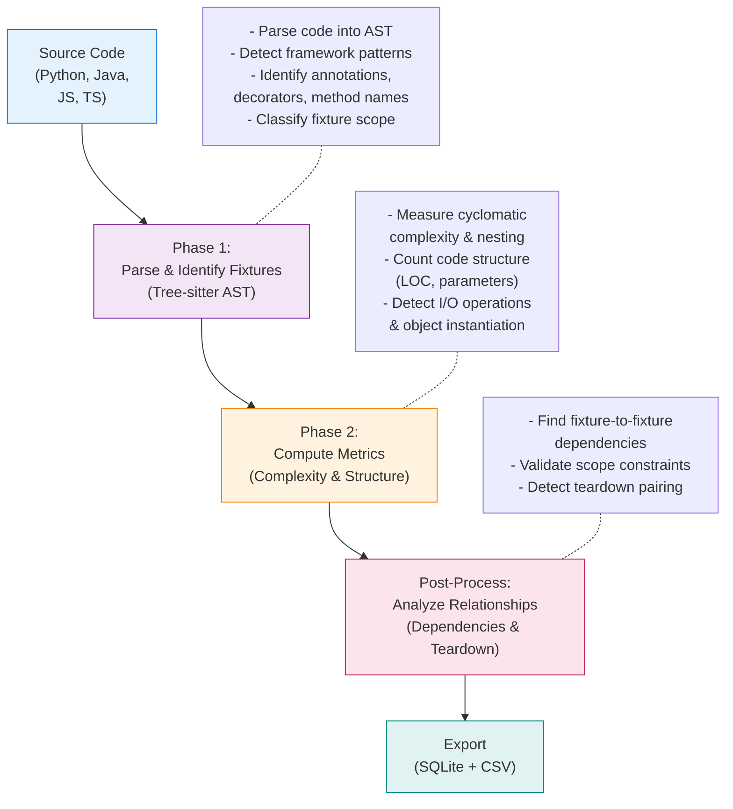

# Fixture Detection Logic

FixtureDB detects test fixture definitions across Python, Java, JavaScript, and TypeScript in two phases:

1. **Detection** — Tree-sitter parses each file into an AST; language-specific pattern tables identify which nodes are fixture definitions (decorators, annotations, method names) and classify their scope/framework.
2. **Metrics & post-processing** — Each detected fixture gets a fixed set of quantitative metrics (§ Fixture Metrics), then a second pass over the whole fixture list detects cross-fixture relationships (teardown pairing, pytest fixture dependencies, scope propagation).

*Mermaid source: [Appendix](#appendix-mermaid-diagram-source).*

## Fixture Detection vs. Agent Detection

This document covers **fixture detection**: identifying test fixture definitions in source code (AST parsing). It is unrelated to **agent detection**: identifying which commits were authored by an AI assistant (git trailer parsing) — see [Agent Detection Methodology](./agent-detection.md).

## How Fixtures Are Detected

| Language | Detection Method | Examples |
|----------|-----------------|----------|
| Python | Decorators & method names | `@pytest.fixture`, `setUp()`, `asyncSetUp()` |
| Java | Annotations & method names | `@Before`, `@BeforeEach`, `@Rule` |
| JavaScript/TypeScript | Hook function calls | `beforeEach()`, `beforeAll()`, `before()` |

No general-purpose tool can distinguish a fixture from a helper function without encoding framework semantics, so detection is pattern-based per language/framework rather than a single generic rule.

The pattern tables are not hardcoded in the per-language detector files — they are loaded from
[collection/heuristics/fixture_definitions.yaml](../../collection/heuristics/fixture_definitions.yaml),
the single source of truth for what counts as a fixture per language. Each language section also
carries an `excluded` list documenting known boundary cases the detector deliberately does not catch
(see [configuration.md](configuration.md#reference-data-catalogs) and
[fixture-patterns-reference.md](../usage/fixture-patterns-reference.md#known-exclusions--boundary-cases)).

**Test coverage:** `tests/collection/test_fixture_definitions_catalog_coverage.py` is parametrized directly over every entry in `fixture_definitions.yaml` (not a hand-picked subset), driving each one through the real `extract_fixtures()` pipeline. Building it surfaced and fixed real bugs in Java's JUnit3 fallback (setUp()/tearDown() detection for un-annotated methods): it could double-detect an already-annotated method, never checked that the enclosing class actually extends `TestCase`, and the `@Rule`/`@ClassRule` field-declaration branch computed complexity metrics in the wrong language mode and produced `<anonymous>_N` names instead of the real field name. Fixed in `detector_java.py`/`detector_shared.py`, regression-tested in `test_java_fixtures.py::TestJUnit3Fallback` and `test_framework_detection.py`'s `@Rule` tests.

### Async Fixtures

Async qualifiers do not change detection: the decorator/annotation/method name is the signal, not whether the function is `async`. `@pytest_asyncio.fixture` matches the same substring check as `@pytest.fixture`. JS/TS `beforeEach(async () => {...})` is still a `call_expression` named `beforeEach` — `async` only qualifies the callback argument. See `TestAsyncPythonFixtures`, `TestAsyncJavaScriptFixtures`, `TestTypeScriptAsyncAwait` in `tests/collection/test_extractor_unit/`.

### Scope Classification

Every fixture is classified into one of four scopes, derived deterministically from explicit framework syntax (never inferred/heuristic):

- **per_test** — before/after each test (most common)
- **per_class** — before/after each test class/suite
- **per_module** — before/after the whole test file (Python-specific)
- **global** — once per test session

Mapping is per-language (e.g. Java `@Before`→per_test, `@BeforeClass`→per_class; JS `beforeEach`→per_test, `beforeAll`→per_class; pytest's explicit `scope=` keyword is read directly). Full per-framework mapping tables: [fixture-patterns-reference.md](../usage/fixture-patterns-reference.md).

---

## Fixture Metrics

Each detected fixture carries these fields (`collection/detector_shared.py::FixtureResult`):

| Metric | How computed | Notes |
|--------|-----------|-------|
| `fixture_type`, `framework`, `scope` | AST pattern match against `fixture_definitions.yaml` | Per-language detector |
| `loc` | Non-blank line count of the fixture's own text | `_count_loc()` |
| `cyclomatic_complexity`, `num_parameters` | Lizard, run on the fixture's isolated source | `complexity_provider.py` |
| `max_nesting_depth` | Custom tree-sitter traversal (Lizard doesn't do function-level nesting) | `_compute_nesting_depth()` |
| `num_objects_instantiated` | Regex over constructor patterns (`new X(...)` for Java/JS/TS, capitalized-call heuristic for Python) | `_count_object_instantiations()` |
| `num_external_calls` | Regex over I/O patterns (db/http/file/subprocess) | `_count_external_calls()` |
| `has_teardown_pair` | Post-processing, paired against other fixtures in the file | `_calculate_teardown_pairs()` |
| `fixture_dependencies` | Post-processing, pytest-only | `_detect_fixture_dependencies()` |
| `num_mocks`, `mocks` | Regex over mock-framework patterns | `_extract_mocks()` |
| `raw_source`, `start_line`, `end_line` | Verbatim fixture text and location, for manual audit | — |

Full per-metric methodology, exact regex catalogs, and known limitations: [metrics-reference.md](metrics-reference.md).

Cognitive complexity was evaluated and dropped entirely (not shipped as a Python-only or formula-approximated metric): its only programmatic implementation (`complexipy`) is Python-specific, and no equivalent exists for Java/JS/TS.

**Bugs found and fixed by this session's audit** (all regression-tested in `tests/collection/test_extractor_metadata/test_new_metrics.py`):
- `max_nesting_depth` was double-counting every level of nesting for Python and Java — a compound statement's own body-wrapper node (`block`) was counted as an *additional* level on top of the statement itself, and Java's `catch_clause`/`finally_clause` were double-counted against their own `try_statement`. JS/TS were unaffected (different grammar node name). Fixed in `_compute_nesting_depth()`.
- For Python's `pytest_decorator` fixtures, the reported line range and `num_external_calls`/`mocks` were scanned over the decorator-inclusive node while `raw_source` used the function-only node — so an `open(...)` or `MagicMock()` call sitting in the decorator's own arguments (e.g. `@pytest.fixture(params=[...])`) leaked into that fixture's metrics, and the reported line range disagreed with `raw_source` by exactly the decorator line. Fixed by scoping every metric to the same node (`_build_result()`).
- `num_parameters` counted Python's implicit `self`/`cls` as an ordinary parameter (Lizard's native behavior), inflating it by 1 for nearly every method-style fixture relative to a bare function or an equivalent Java/JS fixture. Now stripped for Python.
- `new Namespace.ClassName(...)` (e.g. `new THREE.Vector3()`, `new java.util.ArrayList()`) was undercounted by `num_objects_instantiated` — the constructor pattern required a single bare identifier. Fixed in `feature_extraction_patterns.yaml`.

---

## Mock Detection

Mocks are detected in a second pass over each fixture's own already-isolated AST text (not the whole file), against a flat, language-agnostic regex catalog covering `unittest.mock`/`pytest-mock`/`monkeypatch` (Python), Mockito/EasyMock/MockK (Java), and Jest/Sinon/Vitest (JS/TS). Each match records `framework`, a Meszaros test-double `category` (dummy/stub/spy/mock/fake — `dummy` is never assigned, since distinguishing it needs data-flow analysis this detector doesn't do), `target_identifier`, and an interaction-keyword count. Full methodology, pattern catalog, and known scope limits (fixture-local scanning only — module-level `jest.mock(...)` is invisible): [metrics-reference.md § num_mocks](metrics-reference.md#num_mocks-and-the-mock_usages-table).

Pattern/category tables live in [feature_extraction_patterns.yaml](../../collection/heuristics/feature_extraction_patterns.yaml), not hardcoded — see [configuration.md](configuration.md#reference-data-catalogs). Catalog-driven exhaustive tests (`tests/collection/test_mock_detection/test_mock_pattern_catalog_coverage.py`) parametrize over every pattern and assert no other pattern in the catalog also matches the same sample — this caught two real false-positive collisions (`Mock()` matching inside `EasyMock.createMock(...)`; MockK's `mock(X.class)` matching inside `Mockito.mock(X.class)`), both fixed with a word boundary and a negative lookbehind respectively.

---

## Post-Processing (cross-fixture passes)

Run once per file, after every fixture in it has been detected:

- **Teardown pairing** (`_calculate_teardown_pairs`) — flags the setup-side fixture (`has_teardown_pair=1`) via three mechanisms: a `yield` in the fixture's own body (pytest); same fixture_type distinguished by name (`setUp`/`tearDown`); or a different fixture_type at matching scope (`@BeforeEach`/`@AfterEach`, `beforeAll`/`afterAll`, etc.). Pairing rules: `feature_extraction_patterns.yaml`'s `teardown_detection`.
- **Fixture dependencies** (`_detect_fixture_dependencies`, pytest-only) — a fixture's own parameters are cross-referenced against other fixture names in the same file to build a dependency list.
- **Scope propagation** (`_propagate_fixture_scopes`, pytest-only) — if fixture A depends on fixture B and B's scope is narrower than A's declared scope, A is downgraded (an impossible configuration otherwise, e.g. a module-scoped fixture depending on a test-scoped one).

`reuse_count` (test functions using a fixture) was removed entirely rather than fixed — see [metrics-reference.md § reuse_count — removed](metrics-reference.md#reuse_count-removed) for why.

---

## Implementation

- [collection/detector.py](../../collection/detector.py) — slim public facade (`extract_fixtures()`)
- [collection/detector_shared.py](../../collection/detector_shared.py) — dataclasses, parser cache, mock detection, `_build_result()`, cross-fixture post-processing
- [collection/detector_python.py](../../collection/detector_python.py), [collection/detector_java.py](../../collection/detector_java.py), [collection/detector_javascript.py](../../collection/detector_javascript.py) — one per-language detector each

See also: [configuration.md](configuration.md), [metrics-reference.md](metrics-reference.md), [fixture-patterns-reference.md](../usage/fixture-patterns-reference.md)

---

## Appendix: Mermaid Diagram Source

