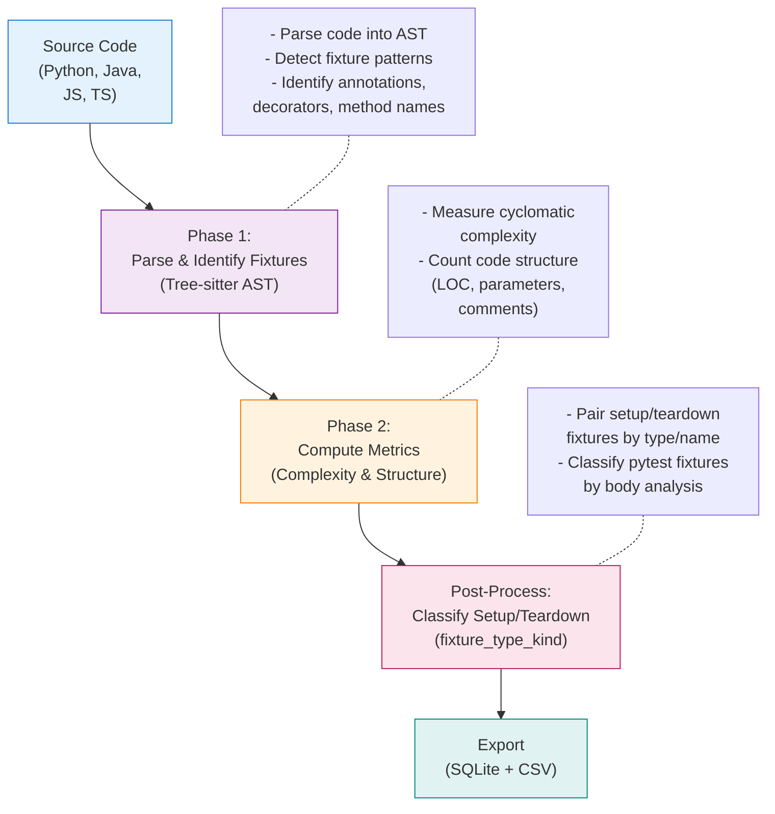

# Fixture Detection Logic

FixtureDB detects test fixture definitions across Python, Java, JavaScript, and TypeScript in two phases. First, detection: Tree-sitter parses each file into an AST, and language-specific pattern tables identify which nodes are fixture definitions (decorators, annotations, method names) and classify their `fixture_type`. Second, metrics and post-processing: each detected fixture gets a fixed set of quantitative metrics (§ Fixture Metrics), then a second pass over the whole fixture list classifies each fixture's `fixture_type_kind` (setup/teardown/setup_and_teardown/other) by cross-referencing it against its paired counterpart.

See the [Appendix](#appendix-mermaid-diagram-source) for a diagram of the pipeline.

## Fixture Detection vs. Agent Detection

This document covers fixture detection: identifying test fixture definitions in source code via AST parsing. It's unrelated to agent detection — identifying which commits were authored by an AI assistant via git trailer parsing — see [Agent Detection Methodology](./agent-detection.md).

## How Fixtures Are Detected

| Language | Detection Method | Examples |
|----------|-----------------|----------|
| Python | Decorators & method names | `@pytest.fixture`, `setUp()`, `asyncSetUp()` |
| Java | Annotations & method names | `@Before`, `@BeforeEach`, `@Rule` |
| JavaScript/TypeScript | Hook function calls | `beforeEach()`, `beforeAll()`, `before()` |

No general-purpose tool can distinguish a fixture from a helper function without encoding framework semantics, so detection is pattern-based per language/framework rather than a single generic rule.

**On the word "heuristics."** Fixture identification itself — whether something is a fixture, and its `fixture_type` — is fully deterministic exact-match pattern lookup: a regex match on decorator text, or a dict lookup on annotation/method/hook name. The three per-language detectors contain no scoring, fuzzy matching, or probabilistic fallback. This holds even though the pattern table lives in a directory named `collection/heuristics/` — that folder is a grab-bag of four unrelated catalogs, and only some of them (mock detection, teardown-pairing — see § Mock Detection and § Post-Processing below) are heuristic in the regex-approximation sense. Those affect metrics computed *on* an already-identified fixture, never the identification decision itself. See [collection/heuristics/\_\_init\_\_.py](../../collection/heuristics/__init__.py)'s module docstring for the per-file breakdown.

The pattern tables aren't hardcoded in the per-language detector files — they're loaded from [collection/heuristics/fixture_definitions.yaml](../../collection/heuristics/fixture_definitions.yaml), the single source of truth for what counts as a fixture per language. Each language section also carries an `excluded` list documenting known boundary cases the detector deliberately doesn't catch (see [configuration.md](configuration.md#reference-data-catalogs) and [fixture-patterns-reference.md](../usage/fixture-patterns-reference.md#known-exclusions--boundary-cases)).

Test coverage: `tests/collection/test_fixture_definitions_catalog_coverage.py` is parametrized directly over every entry in `fixture_definitions.yaml` (not a hand-picked subset), driving each one through the real `extract_fixtures()` pipeline. Java's JUnit3 fallback (`setUp()`/`tearDown()` detection for un-annotated methods) checks that the enclosing class extends `TestCase` and guards against double-detecting an already-annotated method; the `@Rule`/`@ClassRule` field-declaration branch computes complexity metrics in the correct language mode and reports the real field name. Regression-tested in `test_java_fixtures.py::TestJUnit3Fallback` and this same catalog-coverage file's own `test_java_rule_field_declaration_cases`.

### Async Fixtures

Async qualifiers do not change detection: the decorator/annotation/method name is the signal, not whether the function is `async`. `@pytest_asyncio.fixture` matches the same pattern check as `@pytest.fixture`. JS/TS `beforeEach(async () => {...})` is still a `call_expression` named `beforeEach` — `async` only qualifies the callback argument. See `TestAsyncPythonFixtures`, `TestAsyncJavaScriptFixtures`, `TestTypeScriptAsyncAwait` in `tests/collection/test_extractor_unit/`.

---

## Fixture Metrics

Each detected fixture carries these fields (`collection/detector_shared.py::FixtureResult`):

| Metric | How computed | Notes |
|--------|-----------|-------|
| `name`, `fixture_type` | AST pattern match against `fixture_definitions.yaml` | Per-language detector |
| `loc` | Non-blank line count of the fixture's own text | `_count_loc()` |
| `cyclomatic_complexity`, `num_parameters` | Lizard, run on the fixture's isolated source | `complexity_provider.py` |
| `num_comment_lines`, `comment_density` | Tree-sitter comment-node walk | `_count_comment_lines()` |
| `fixture_type_kind` | Post-processing, paired against other fixtures in the file (`pytest_decorator` classified directly from body analysis instead) | `_classify_fixture_kinds()` |
| `mocks` | Regex over mock-framework patterns | `_extract_mocks()` |
| `raw_source`, `start_line`, `end_line` | Verbatim fixture text and location, for manual audit | — |

`num_mocks` is not a `FixtureResult` field — it's derived downstream as `len(mocks)` at export time (`corpus_utils.py`, `db.py`), not stored on the dataclass itself.

`scope`, `framework`, `max_nesting_depth`, `num_objects_instantiated`, `num_external_calls`, `has_teardown_pair`, and `fixture_dependencies` were removed from the extracted metric set entirely -- `scope`/`framework` were fully redundant with `fixture_type` (1:1 mapping verified across the collected data), and the other four simply aren't part of the paper's reported metrics. See [metrics-reference.md](metrics-reference.md) for the full removal rationale.

Full per-metric methodology and known limitations for what remains: [metrics-reference.md](metrics-reference.md).

Cognitive complexity was evaluated and dropped entirely (not shipped as a Python-only or formula-approximated metric): its only programmatic implementation (`complexipy`) is Python-specific, and no equivalent exists for Java/JS/TS.

`cyclomatic_complexity`/`num_parameters`/`comment_density` are regression-tested in `tests/collection/test_extractor_metadata/test_new_metrics.py`; `fixture_type_kind` classification in `tests/collection/test_fixture_kind_classification.py`.

---

## Mock Detection

Mocks are detected in a second pass over each fixture's own already-isolated AST text (not the whole file), against a flat, language-agnostic regex catalog covering `unittest.mock`/`pytest-mock`/`monkeypatch` (Python), Mockito/EasyMock/MockK (Java), and Jest/Sinon/Vitest (JS/TS). Each match records `framework`, `target_identifier`, and an interaction-keyword count.

Each fixture is also classified into a Meszaros test-double `category` (dummy/stub/spy/mock/fake) — a single classification per fixture, applied to every mock recorded in it, computed by scanning the fixture's own full body text for one of the five category keywords, case-insensitively, in priority order dummy > stub > spy > fake > mock (first match wins; falls back to `mock`, the least-specific term, when no keyword is found). This is an identifier-driven scan of the actual code, the same method used in related work, not a lookup keyed on which framework/pattern matched — `dummy` is a real, reachable outcome (e.g. a `dummy_request = Mock()` assignment), unlike the fixed per-pattern classification this replaced. Full methodology and known scope limits (fixture-local scanning only — module-level `jest.mock(...)` is invisible): [metrics-reference.md § num_mocks](metrics-reference.md#num_mocks-and-the-mock_usages-table).

Pattern/framework tables live in [feature_extraction_patterns.yaml](../../collection/heuristics/feature_extraction_patterns.yaml), not hardcoded — see [configuration.md](configuration.md#reference-data-catalogs). Catalog-driven exhaustive tests (`tests/collection/test_mock_detection/test_mock_pattern_catalog_coverage.py`) parametrize over every pattern and assert no other pattern in the catalog also matches the same sample — e.g. `Mock()` is word-boundary-scoped so it does not match inside `EasyMock.createMock(...)`, and MockK's `mock(X.class)` pattern excludes `Mockito.mock(X.class)` via a negative lookbehind.

---

## Post-Processing (cross-fixture passes)

Run once per file, after every fixture in it has been detected:

- **`fixture_type_kind` classification** (`_classify_fixture_kinds`) labels every fixture except `pytest_decorator` as `setup`, `teardown`, or `other`, by cross-referencing its `fixture_type` against `feature_extraction_patterns.yaml`'s `teardown_detection` tables: the same fixture type distinguished by name (`setUp`/`tearDown`), or a different fixture type at the matching position (`@BeforeEach`/`@AfterEach`, `beforeAll`/`afterAll`, etc.). `pytest_decorator` is classified separately, directly from body analysis (presence/position of `yield`) at detection time, since every pytest fixture is just named whatever the developer called it -- this is also the one path that can produce `setup_and_teardown`, which the type/name-based classification above never does.

Two other cross-fixture passes -- a binary `has_teardown_pair` indicator, and pytest fixture-dependency/scope-propagation tracking -- were removed entirely along with the fields they only ever fed (see [metrics-reference.md](metrics-reference.md)). `reuse_count` (test functions using a fixture) was removed earlier, for a different reason (a fabricated metric, not an unused one) — see [metrics-reference.md § reuse_count — removed](metrics-reference.md#reuse_count-removed).

---

## Implementation

- [collection/detector.py](../../collection/detector.py) — slim public facade (`extract_fixtures()`)
- [collection/detector_shared.py](../../collection/detector_shared.py) — dataclasses, parser cache, mock detection, `_build_result()`, cross-fixture post-processing
- [collection/detector_python.py](../../collection/detector_python.py), [collection/detector_java.py](../../collection/detector_java.py), [collection/detector_javascript.py](../../collection/detector_javascript.py) — one per-language detector each

See also: [configuration.md](configuration.md), [metrics-reference.md](metrics-reference.md), [fixture-patterns-reference.md](../usage/fixture-patterns-reference.md)

---

## Appendix: Mermaid Diagram Source

```mermaid
flowchart TB
    A["Source Code<br>(Python, Java,<br>JS, TS)"] --> B["Phase 1:<br>Parse &amp; Identify Fixtures<br>(Tree-sitter AST)"]
    B --> C["Phase 2:<br>Compute Metrics<br>(Complexity &amp; Structure)"]
    C --> D["Post-Process:<br>Classify Setup/Teardown<br>(fixture_type_kind)"]
    D --> E["Export<br>(SQLite + CSV)"]
    B1["- Parse code into AST<br>- Detect fixture patterns<br>- Identify annotations,<br>  decorators, method names"] -.- B
    C1["- Measure cyclomatic<br>  complexity<br>- Count code structure<br>  (LOC, parameters,<br>  comments)"] -.- C
    D1["- Pair setup/teardown<br>  fixtures by type/name<br>- Classify pytest fixtures<br>  by body analysis"] -.- D

    style A fill:#e3f2fd,stroke:#1976d2
    style B fill:#f3e5f5,stroke:#7b1fa2
    style C fill:#fff3e0,stroke:#f57c00
    style D fill:#fce4ec,stroke:#c2185b
    style E fill:#e0f2f1,stroke:#00897b
```
