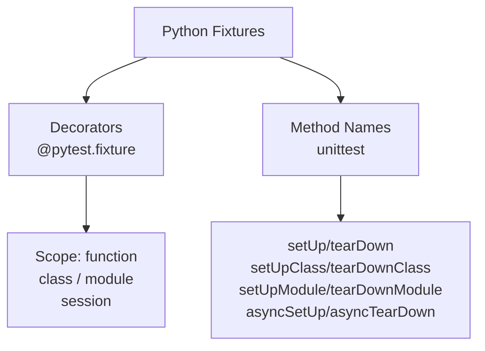
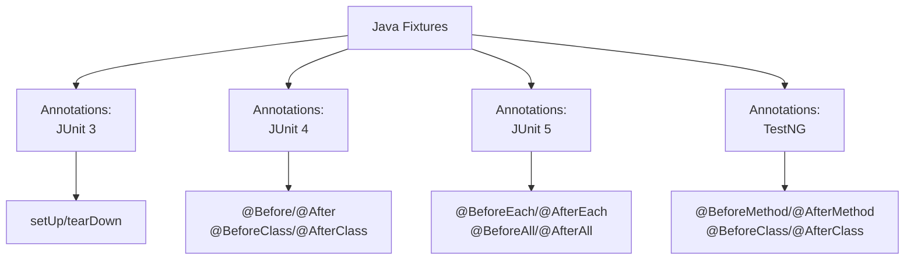
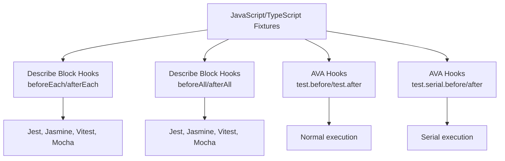

# Fixture Patterns Reference

Comprehensive catalog of 30+ fixture types detected across Python, Java, JavaScript, and TypeScript.

**Scope policy:** only the dominant, actively-maintained testing frameworks
per language are covered (pytest/unittest for Python, JUnit/TestNG for
Java) — never frameworks layered on top of them (e.g. Spring, Cucumber) or
niche/legacy testing frameworks (e.g. nose, Behave). Once one such
framework's own conventions are in scope, there's no principled place to
stop, since every other framework a project might use has an equally valid
claim to inclusion. See "Known Exclusions & Boundary Cases" below for the
full list and reasoning.

**Source of truth:** the tables below are prose explanations of what's
actually in `collection/config_data/fixture_definitions.yaml`, which the
detector modules (`detector_python.py`/`detector_java.py`/`detector_javascript.py`)
load at import time — that YAML file is the executable definition, and also
documents, per language, which boundary cases are deliberately **not**
detected and why (see "Known Exclusions & Boundary Cases" below).

## Fixture Taxonomy Overview

Fixture definitions are organized by **language** and **pattern type**. Each language has distinct mechanisms for declaring fixtures—some use decorators, others use method names or attributes. Detailed taxonomy diagrams for each language are shown in their respective sections below.

**Fixture Scope:** Most frameworks support multiple scopes (per-test, per-class, per-module, global). See each language section for scope details.

## Quick Lookup

| Framework | Language | Fixture Type | Pattern | Scope |
|-----------|----------|--------------|---------|-------|
| pytest | Python | pytest_decorator | `@pytest.fixture` | per_test, per_class, per_module, global |
| unittest | Python | unittest_setup | `def setUp/tearDown/setUpClass/tearDownClass/asyncSetUp/asyncTearDown` | per_test, per_class, per_module |
| JUnit 3 | Java | junit3_setup/junit3_teardown | `def setUp()/tearDown()` | per_test |
| JUnit 4 | Java | junit4_before/after/before_class/after_class | `@Before/@After/@BeforeClass/@AfterClass` | per_test, per_class |
| JUnit 5 | Java | junit5_before_each/after_each/before_all/after_all | `@BeforeEach/@AfterEach/@BeforeAll/@AfterAll` | per_test, per_class |
| TestNG | Java | testng_before_method/after_method/before_class/after_class | `@BeforeMethod/@AfterMethod/@BeforeClass/@AfterClass` | per_test, per_class |
| Jest/Mocha/Jasmine/Vitest | JavaScript | before_each/after_each/before_all/after_all | `beforeEach/afterEach/beforeAll/afterAll(...)` | per_test, per_class |
| Mocha | JavaScript | mocha_before/mocha_after | `before/after(...)` | per_test |
| AVA | JavaScript/TypeScript | ava_before/after/serial_before/serial_after | `test.before/.after/.serial.before/.serial.after(...)` | per_test, per_class |

---

## Python Fixtures

### Fixture Taxonomy (Python)

```
Python Fixtures
├── Decorators
│   └── @pytest.fixture / @pytest_asyncio.fixture
├── Method Names (unittest)
│   ├── setUp/tearDown
│   ├── setUpClass/tearDownClass
│   ├── setUpModule/tearDownModule
│   └── asyncSetUp/asyncTearDown (IsolatedAsyncioTestCase)
└── Scope: per_test, per_class, per_module, global
```

### pytest Fixtures

**Pattern:** `@pytest.fixture` decorator  
**Scope:** Configurable via `scope="function|class|module|session"`

### unittest Fixtures

**Pattern:** Method names: `setUp()`, `tearDown()`, `setUpClass()`, `tearDownClass()`, `setUpModule()`, `tearDownModule()`, `asyncSetUp()`, `asyncTearDown()` (the last two are `IsolatedAsyncioTestCase`'s own hooks, called in addition to `setUp()`/`tearDown()`, not a replacement for them)
**Scope:** Determined by method name and class context

**Teardown pairing (`has_teardown_pair`):** in addition to a same-scope, separately-named teardown method (`setUp`→`tearDown`, `setUpClass`→`tearDownClass`), a `setUp()`/`setUpClass()` fixture is also flagged as having a teardown pair if its own body registers cleanup inline via `self.addCleanup(...)`/`self.enterContext(...)` (per-test) or `cls.addClassCleanup(...)`/`cls.enterClassContext(...)` (per-class) — the modern, docs-recommended alternative to a separate teardown method. See `collection/config_data/feature_extraction_patterns.yaml`'s `teardown_detection.self_registered_cleanup` table.

---

## Java Fixtures

### Fixture Taxonomy (Java)

```
Java Fixtures
├── Annotations
│   ├── JUnit 3: setUp/tearDown (methods)
│   ├── JUnit 4: @Before/@After/@BeforeClass/@AfterClass
│   ├── JUnit 5: @BeforeEach/@AfterEach/@BeforeAll/@AfterAll
│   └── TestNG: @BeforeMethod/@AfterMethod/@BeforeClass/@AfterClass
└── Scope: per_test, per_class, per_module (via @BeforeAll)
```

### JUnit 3 (Legacy)

**Pattern:** Method names: `setUp()`, `tearDown()`, with no annotation at all, in a class that extends `TestCase`  
**Scope:** per_test

Both conditions are required: an annotated method (even one the detector doesn't recognize, e.g. `@Test`) is never treated as a JUnit3 fixture regardless of its name, and a plain `setUp()`/`tearDown()` in a class that does **not** extend `TestCase` is not detected either.

### JUnit 4

**Pattern:** Annotations: `@Before`, `@After`, `@BeforeClass`, `@AfterClass`  
**Scope:** Determined by annotation type

**Scope Mapping:**
- `@Before` → per_test
- `@After` → per_test
- `@BeforeClass` → per_class
- `@AfterClass` → per_class

**Detection Logic:**
1. Find `method_declaration` nodes
2. Scan for `modifiers` child with annotations
3. Extract annotation name (`@Before`, etc.)
4. Look up in JUNIT_FIXTURE_ANNOTATIONS dict

### JUnit 5

**Pattern:** Annotations: `@BeforeEach`, `@AfterEach`, `@BeforeAll`, `@AfterAll`  
**Scope:** Determined by annotation type

### TestNG

**Pattern:** Annotations: `@BeforeMethod`, `@AfterMethod`, `@BeforeClass`, `@AfterClass`  
**Scope:** Method or class level

---

### JUnit 5 (Jupiter)

**Type:** `junit5_before_each`, `junit5_after_each`, `junit5_before_all`, `junit5_after_all`  
**Framework:** JUnit 5  
**Pattern:** Methods annotated with `@BeforeEach`, `@AfterEach`, `@BeforeAll`, `@AfterAll`

```java
import org.junit.jupiter.api.BeforeEach;
import org.junit.jupiter.api.AfterEach;
import org.junit.jupiter.api.BeforeAll;
import org.junit.jupiter.api.AfterAll;
import org.junit.jupiter.api.Test;

public class MyTest {
    @BeforeAll
    static void setupOnce() {
        // Runs once before all tests
        System.out.println("Suite setup");
    }
    
    @BeforeEach
    void setUp() {
        // Runs before each test
        System.out.println("Test setup");
    }
    
    @AfterEach
    void tearDown() {
        // Runs after each test
        System.out.println("Test teardown");
    }
    
    @AfterAll
    static void tearDownOnce() {
        // Runs once after all tests
        System.out.println("Suite teardown");
    }
    
    @Test
    void testSomething() {
        // test code
    }
}
```

**Scope Mapping:**
- `@BeforeEach` → per_test
- `@AfterEach` → per_test
- `@BeforeAll` → per_class
- `@AfterAll` → per_class

---

### TestNG

**Type:** `testng_before_method`, `testng_after_method`, `testng_before_class`, `testng_after_class`, `testng_data_provider`  
**Framework:** TestNG  
**Pattern:** Methods annotated with TestNG annotations

```java
import org.testng.annotations.BeforeMethod;
import org.testng.annotations.AfterMethod;
import org.testng.annotations.BeforeClass;
import org.testng.annotations.AfterClass;
import org.testng.annotations.DataProvider;
import org.testng.annotations.Test;

public class MyTest {
    @BeforeClass
    public void setupClass() {
        // Class-level setup
    }
    
    @BeforeMethod
    public void setup() {
        // Per-test setup
    }
    
    @DataProvider(name = "testData")
    public Object[][] dataProvider() {
        // Returns data for parametrized tests
        return new Object[][] {
            {1, 2},
            {3, 4}
        };
    }
    
    @Test(dataProvider = "testData")
    public void testWithData(int a, int b) {
        // Test using data from provider
    }
    
    @AfterMethod
    public void teardown() {
        // Per-test cleanup
    }
    
    @AfterClass
    public void teardownClass() {
        // Class-level cleanup
    }
}
```

**Scope Mapping:**
- `@BeforeMethod` → per_test
- `@AfterMethod` → per_test
- `@BeforeClass` → per_class
- `@AfterClass` → per_class
- `@DataProvider` → per_test

---

## JavaScript & TypeScript Fixtures

### Fixture Taxonomy (JavaScript/TypeScript)

```
JavaScript/TypeScript Fixtures
├── Describe Block Hooks (Most frameworks)
│   ├── beforeEach/afterEach (per-test)
│   ├── beforeAll/afterAll (per-suite)
│   └── Supported by: Jest, Jasmine, Vitest, Mocha
├── AVA Hooks (Serial execution)
│   ├── test.before/test.after
│   └── test.serial.before/test.serial.after
└── Scope: per_test (beforeEach/afterEach, test.before)
         per_class (beforeAll/afterAll)
         serial (AVA serial hooks)
```

### Jest/Jasmine/Vitest (Standard Hooks)

**Type:** `before_each`, `after_each`, `before_all`, `after_all`  
**Frameworks:** Jest, Jasmine, Vitest  
**Pattern:** Hook functions: `beforeEach()`, `afterEach()`, `beforeAll()`, `afterAll()`

```javascript
describe('User Service', () => {
    let userService;
    let database;
    
    // Runs once before all tests in this suite
    beforeAll(() => {
        database = new Database();
        database.connect();
    });
    
    // Runs before each test
    beforeEach(() => {
        userService = new UserService(database);
        jest.clearAllMocks();
    });
    
    // Runs after each test
    afterEach(() => {
        userService = null;
    });
    
    // Runs once after all tests in this suite
    afterAll(() => {
        database.disconnect();
    });
    
    test('should create user', () => {
        const user = userService.create('john');
        expect(user.name).toBe('john');
    });
});
```

**Scope Mapping:**
- `beforeEach` → per_test
- `afterEach` → per_test
- `beforeAll` → per_class
- `afterAll` → per_class

---

### Mocha (Ambiguous Hooks)

**Pattern:** `before()`, `after()` — Scope determined by nesting (per-test by default)

### AVA

**Pattern:** `test.before()`, `test.after()`, `test.serial.before()`, `test.serial.after()`  
**Scope:** Serial/non-serial determines per-test vs. per-class behavior

---

## Async Fixtures

Async fixture definitions are detected identically to sync ones: the
lifecycle hook name, decorator, or annotation is the detection signal, not
the function's async qualifier.

| Language | Async form | Detected as |
|---|---|---|
| Python | `@pytest.fixture` / `@pytest_asyncio.fixture` decorating `async def` | `pytest_decorator` (same `fixture_type` as the sync form — `pytest_asyncio` is not a separate type) |
| JavaScript/TypeScript | `beforeEach(async () => {...})`, `before(async function() {...})` | Same `fixture_type` as the sync call (the call's function name is unaffected by the callback's `async` qualifier) |
| TypeScript (decorator style) | `@BeforeEach async setup() {...}` | Same `fixture_type` as the sync method (the decorator precedes the method regardless of `async`) |

This is a load-bearing detail, not an incidental one: `@pytest_asyncio.fixture`
is the standard way to declare async test setup for FastAPI and other async
Python frameworks, and async `beforeEach`/`before` hooks are the norm in
modern Jest/Mocha/Vitest suites — a detector that missed the async forms
would systematically undercount fixtures in async-heavy codebases. Verified
by `TestAsyncPythonFixtures`, `TestAsyncJavaScriptFixtures`,
`TestTypeScriptAsyncAwait`, and `TestTypeScriptDecoratorHooks` in
`tests/collection/test_extractor_unit/`.

---

## Fixture Relationships

### Fixture Dependency Tracking

Fixture relationships capture how fixtures depend on each other:

```
Example: pytest fixture dependency

@pytest.fixture(scope="session")
def database():
    db = Database.open()
    yield db
    db.close()

@pytest.fixture
def user(database):  # ← depends on 'database' fixture
    user = User.create(database)
    yield user
    user.delete()

def test_user_profile(user):  # ← depends on 'user' fixture
    assert user.id is not None
```

**Relationship Types:**

1. **Direct Dependency** — Fixture A requires Fixture B as a parameter
   ```python
   def fixture_a(fixture_b):  # A depends on B
       pass
   ```

2. **Scope Hierarchy** — Broader-scope fixtures enable narrower-scope fixtures
   ```python
   @pytest.fixture(scope="module")
   def module_db():  # Broader scope
       pass
   
   @pytest.fixture(scope="function")
   def test_db(module_db):  # Narrower scope depends on broader
       pass
   ```

3. **Framework Nesting** — Describe blocks nest beforeEach hooks
   ```javascript
   describe("outer", () => {
       beforeAll(() => setup1());
       
       describe("inner", () => {
           beforeAll(() => setup2());  // setup2 runs after outer setup1
       });
   });
   ```

**Future Enhancement:**
The FixtureDB can track fixture relationships to:
- Build fixture dependency graphs
- Analyze fixture initialization order
- Detect circular dependencies
- Optimize fixture reuse

---

---

## Known Exclusions & Boundary Cases

Every pattern above is what the detector matches; just as important is what
it deliberately does **not** match, and why. This makes the recall boundary
explicit for reviewers instead of leaving it implicit in the source code.
The authoritative version of this list lives in the `excluded` section of
each language block in `collection/config_data/fixture_definitions.yaml` —
reproduced here for readability.

### Python

- **Fixtures defined in installed pytest plugins / external packages** — detection is per-file AST scanning of the cloned repo; a fixture registered via `pytest_plugins` pointing at an installed package has no source file in the repo to scan.
- **Custom decorators that wrap `@pytest.fixture` internally** (e.g. `@my_fixture_wrapper`) — matching is a literal substring check on the decorator's own text (must contain both `"pytest"` and `"fixture"`); a differently-named decorator whose *implementation* calls `pytest.fixture()` internally does not itself contain those substrings at the call site.
- **Fixtures created dynamically** (metaprogramming, `exec()`, runtime-generated decorators) — AST-based detection requires the fixture to exist as literal source text.
- **`mock.patch` (or any other non-fixture decorator) on an ordinary test function** — not a fixture and not matched by design; listed to make the boundary explicit.
- **nose/nose2 `setup()`/`teardown()`/`setup_module()`/etc.** — scope decision: only pytest and unittest are covered, the two dominant, actively-maintained Python testing frameworks. nose has been unmaintained/deprecated for years; adding it back reopens the question of where the line is for every other niche framework, which isn't answerable.
- **Behave BDD step decorators** (`@given`/`@when`/`@then`/`@step`) — same scope decision as nose: Behave is a BDD framework, not one of Python's two dominant testing frameworks.

### Java

- **JUnit 5 Extension lifecycle methods** (`BeforeEachCallback`, `AfterEachCallback`, etc.) — implemented via interfaces, not annotations; the detector only looks for annotation nodes.
- **TestNG `@BeforeSuite` / `@AfterSuite` / `@BeforeTest` / `@AfterTest`** — only `@BeforeMethod`/`@AfterMethod` are handled; the other TestNG lifecycle levels are not in the annotation table.
- **Spring (all annotations, e.g. `@Bean`, `@TestConfiguration`, `@BeforeTransaction`/`@AfterTransaction`)** — scope decision: only JUnit and TestNG are covered, Java's two dominant testing frameworks. Spring is a dependency-injection framework, not a testing framework; there's no principled place to stop once one non-testing framework's own conventions are in scope.
- **Cucumber (all annotations, e.g. `@Given`, `@When`, `@Then`, `@And`, `@But`, `@Attachment`)** — same scope decision as Spring: Cucumber is a BDD framework, not JUnit or TestNG.

Two known imprecisions (detected, but not perfectly attributed) are also worth calling out:
- `@BeforeClass`/`@AfterClass` are ambiguous between JUnit4 and TestNG; the detector always attributes them to TestNG (both `fixture_type` and `framework`) rather than inspecting imports to disambiguate.
- Fixture scope is inferred from annotation type (`@BeforeAll` → `per_class`, `@BeforeEach` → `per_test`). JUnit 5's instance lifecycle annotation (`@TestInstance(Lifecycle.PER_CLASS)`), which can modify the effective scope of `@BeforeAll` (allowing it to be a non-static, per-instance method shared across the class's tests instead of a true static per-class hook), is not currently accounted for.

### JavaScript/TypeScript

- **Jest `globalSetup` / `globalTeardown`** — configured as a file path in `jest.config.js`, not an inline function call in the test file; there's no call-expression node to match.
- **Vitest `setupFiles`** — configuration-level (`vitest.config.*`), not an inline fixture; same reasoning as Jest `globalSetup`.
- **Custom test helpers not using a recognized framework lifecycle hook name** — detection is a fixed name/pattern lookup; a hand-rolled helper called manually inside each test body is not a lifecycle hook.
- **AVA fixtures accessed through an aliased import** (e.g. `import ava from 'ava'; ava.before(...)`) — the AVA match requires the member-expression's object to be literally named `test` (i.e. `test.before(...)`).

---

## See Also

- [detection.md](../architecture/detection.md) — How fixtures are detected (technical overview)
- [metrics-reference.md](../architecture/metrics-reference.md) — Quantitative metrics extracted per fixture

---

## Appendix: Language-Specific Fixture Taxonomy

The fixture taxonomy diagrams above are generated from the following Mermaid source code. These can be used to regenerate or modify the diagrams:

### Python Fixture Taxonomy



### Java Fixture Taxonomy



### JavaScript/TypeScript Fixture Taxonomy



